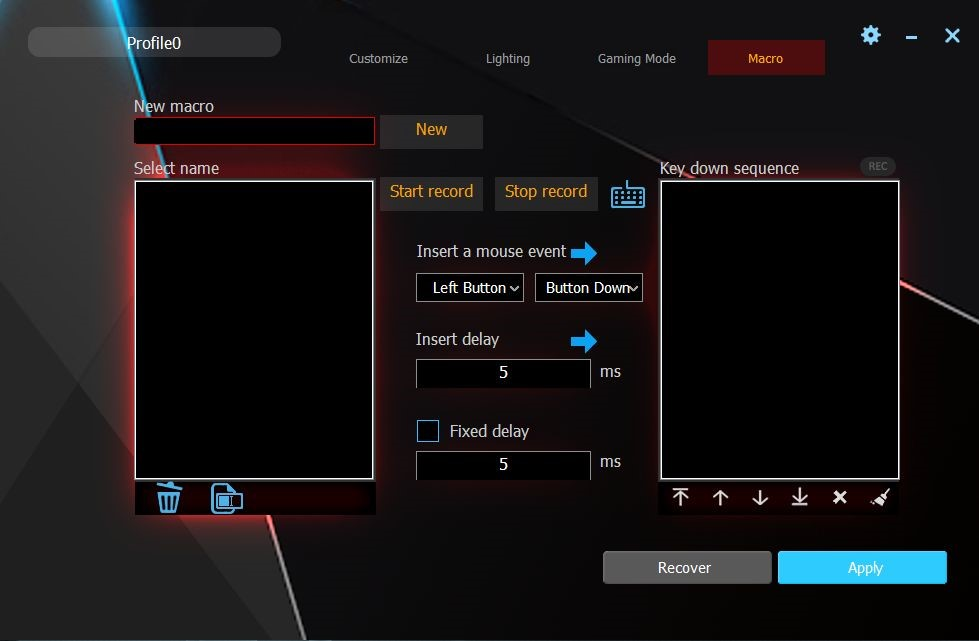
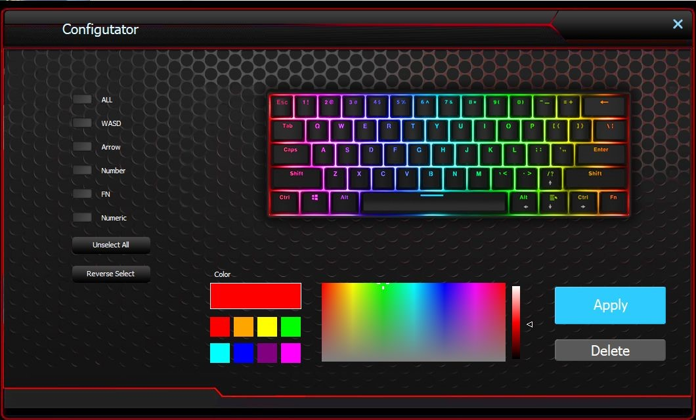

# DK61 / Hiwings HI200 / oneone nya / FEKER Machinist 01 / Gamdias Hermes E3

> This article is a work in progress. The information attempts to be as accurate as possible at the time of writing.

## Introduction

I was on the market for a cheap mechnical keyboard with a reduced footprint for my desk. After a quick, uninformed marketplace search, I purchased a cheap 60% mechanical keyboard from a China-based seller on eBay. I also bought some cheap keycaps to replace the stock "gamer" ones. The keyboard itself is unbranded except for the "DK61" model number on the back. There are a few YouTube reviews that describe this keyboard as a "Anne Pro 2" or "RK61" clone.

> Although they share the same model number, this is not the exact same product as the Dierya / Kemove DK61.

This keyboard boasts Bluetooth 5.0 (or a reflashed Bluetooth 3.0 / 4.0 module that identifies as Bluetooth 5.0?) as well as the typical USB-C connectivity.

There is also an interesting key order in the bottom right (Alt - Fn - App - Ctrl), which is a little different to most 60% keyboards on the market. The standard keycaps on this keyboard also show arrow keys on the Fn layer of the WASD keys, which is also different to the typical keymapping on (/ - Alt - App - Control) found on similar keyboards.

There is also a battery that can be used for power via an On/Off switch on the back of the keyboard for use with the Bluetooth connectivity (the battery capacity is unfortunately not marked).

It does not come with software included, nor is any software mentioned in the product description for download.

## Similar Products

After analysis of similar products while considering the key order and the default keymapping of this keyboard, it looks like this model can be found rebranded and sold under several other names. I fell into a rabbit hole of 60% keyboard research - there are tons of them that are similar!

> Not all of the products listed below have Bluetooth. They could be a combination of wired, 2.4G wireless and Bluetooth.

Here are a few examples:
- Hiwings HI200
- GOCOMMA DK61
- Magic Refiner MK25
- oneone nya
- FEKER Machinist 01
- LeaningTech LTC K61
- Gamdias Hermes E3
- Redragon K530
- Keychron K12
- Royal Kludge RK61
- Lushujun DK61

> The [SonixQMK Mechnical Keyboard Database on GitHub](https://github.com/SonixQMK/Mechanical-Keyboard-Database) was a very useful reference throughout this work.

## Under The Hood

The next step was to disassemble the keyboard to find out more about the internals.

Here's a summary of the details:

| Attribute      | Value |
| ----------- | ----------- |
| Vendor ID | 05AC |
| Product ID | 024F |
| Hardware ID (VID/PID) | 05AC:024F |
| Switches | Outemu Brown (Soldered) |
| Keycap Material | PBT |
| Battery | Unmarked with undefined capacity |
| PCB | PCBG49RGB-TB3.0/5.0/2.4GHFD REV 1.3 2020/06/30 |
| MCU | HFD2201KBA |
| Bluetooth Module | CYW20730 |

## Firmware: Part 1

There are some interesting design choices in the default firmware. The key mapping for the arrow keys are unintuitive. For example, you have to hold down Fn + W for 3 secs to have WASD swap to arrow keys, then Fn + W to go back - super slow! The numpad functions were also difficult to remember due to their positioning. Thus began the next phase of research - flashing alternative firmware.

To start my alternative firmware experiment, I attempted to flash several other keyboard's stock firmwares. As mentioned previously, this keyboard has 05AC:024F as the hardware ID (VID/PID). This is the combination for the Apple Magic Keyboard, but can also be found on early Keychrons as well as some versions of the Royal Kludge RK61. Most stock keyboard firmwares that are based on the HFD ISP Tool seem to work, though some check for a supported USB HID device via hardware ID.

The most successful was flashing the Keychron K12 stock firmware (which uses the HFD ISP Tool). Most keys worked as expected - the bottom right 4 keys were in a strange order, and Fn2 (as per the K12 layout) was not bound at all. Fn1 key combos worked perfectly.

## Software

I attempted to use the customisation software of similar keyboards with the out of the box firmware. These tools allow some basic customisation of key mapping and RGB LED values, as well as creation of basic macro automations. ultimately the bottom right order can be troublesome. All of these software are reskins of the same software 'GamingForceZ RGB Keyboard v1.10.000n' by SONiX (NB: see the _"GamingKeyboard*.dll"_ files found all of the variants), and have the same features and UI (apart from Drevo Power Console, which has the same functionality but with a more modern UI experience). Some of the variants do check for their specific keyboard (I assume via hardware ID) and will display a Device Not Found error, but these are the minority. Amusingly, all of the variants have the same metadata for their _"GamingKeyboard*.dll"_ files:

| Attribute      | Value |
| ----------- | ----------- |
| LegalCopyright | TODO: (c) <Company name>. All rights reserved. | 
| InternalName | GamingKeyboardMacro.dll |
| FileVersion | 1.0.0.1 |
| CompanyName | TODO: <Company name> |
| ProductName | TODO: <Product name> |
| ProductVersion | 1.0.0.1 |
| FileDescription | TODO: <File description> |

Here are a few examples of the software variants as per their installation name. Most of these worked for this keyboard to some degree, but I recommend checking the key layout of the particular keyboard that was in mind for each variant:
- FEKER Machinist01
- Horizon Z Gaming Keyboard Driver
- Drevo Power Console
- Redragon K530RGB Keyboard
- GamingForceZ RGB RK61
- HyperX Genesis
- Blitzwolf KB-1
- Velocifire TKL61WS Software
- GS87D-RGB Keyboard
- Ozone BattleRoyale
- Lam-Ang Pro
- RAKK ILIS Mechanical Keyboard
- DAXA M84 SERIES

## Firmware: Part 2

Still wanting additional control over this keyboard, internet searches led me to a custom firmware project called [QMK](https://qmk.fm/). I was then led to the flavour that was relevant to my keyboard's MCU - [SonixQMK](https://github.com/SonixQMK/qmk_firmware).

The MCU for the keyboard is a HFD chip. HFD and EVision chips are common rebrands of SONiX SN32-based chips.

SONiX chips typically have a BOOT pin exposed on the PCB. This can be shorted to GND (ground) when plugging in the keyboard, which then puts the keyboard into bootloader mode. The keyboard is borderline unbrickable as the bootloader is stored in ROM.

To flash QMK with this type of chip, you would usually need to put the keyboard in bootloader mode with the above process.

> At the time of writing, QMK does not support / provide Bluetooth functionality.

Through further digging and support from The Sonix Keyboard Hacking Community that maintain SonixQMK, I managed to install a release of SonixQMK on the keyboard - without touching the BOOT pin. The process was as follows:

1. Install the Flashquark Horizon Z stock firmware ("Horizon Z Firmware Flasher 1.1 202006.exe"). The executable uses the HFD ISP Tool for the flashing process. After successful flash, all functionality of the Horizon Z works (including Bluetooth and key combinations) except there is one dead key (Alt key on the original keyboard. It also lights up green or light pink regardless of RGB LED configuration).

2. Install Flashquark Horizon Z QMK Flasher ("Horizon Z QMK Flasher 1.0.exe"). No pin shorting is required by using this flashing tool. This also uses HFD ISP Tool for the flashing, and actually flashes a release of SonixQMK. After successful flash, functionality is the same as the end of Step 1 (except no Bluetooth functionality), but with QMK now on the keyboard. Crucially, Left Ctrl + Right Alt (which is accessed by pressing the Fn key with the physical Alt key) can be used to put the keyboard into bootloader mode, removing the need for pin shorting in the future if you wish to flash any other firmware. This is handy if you wish to try flashing other firmware onto the keyboard in the future, such as the Horizon Z stock firmware in Step 1 if you want Bluetooth functionality.

## Future Work

The next step would be to alter the QMK configuration on the keyboard so that the 4 right keys work as expected. If this is possible, this would be a cheap, easy-to-flash, readily available "QMK-able" keyboard that doesn't require disassembly. With the rapid speed in which QMK is maturing, it would be great to see Bluetooth functionality supported within the QMK firmware in the near future.